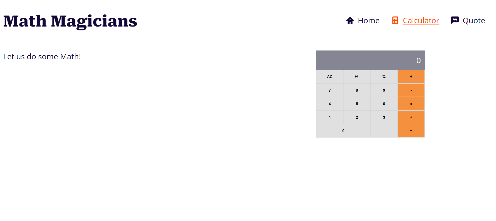

# math-magicians

This a website that provides a math calculator to perform mathematical operations.

This project is a math-magicians app.

## Built With

- React
- CSS

## Getting Started
To get the content of this project locally you need to run this command in your terminal:
- git clone your https://github.com/matovu-farid/math-magicians.git
- cd project math-magicians
- npm install
- npm start
### Deployment
This project is deployed on a github page on the link below:
- https://matovu-farid.github.io/math-magicians/
## Author

👤 **Matovu Farid Nkoba**

- GitHub: [@matovu-farid](https://github.com/matovu-farid)
- Twitter: [@matovu100](https://twitter.com/matovu100)
- LinkedIn: [matovu-farid](https://www.linkedin.com/in/matovu-farid-48b80257)

## 📝 License

This project is [MIT](./MIT.md) licensed.
